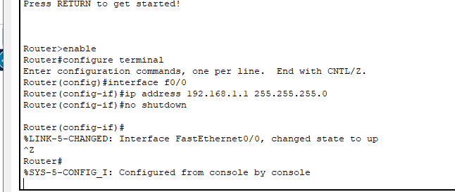

# 实验一用交换机构建 LAN

1.PC0 能否 ping 通 PC1、PC2、PC3 ？

能ping通pc1 但无法ping通pc2和3

2.PC3 能否 ping 通 PC0、PC1、PC2 ？为什么？

pc3只能ping通pc2 无法ping通其他的
大概是因为pc0和pc1与pc3不在同一子网中

3.将 4 台 PC 的掩码都改为 255.255.0.0 ，它们相互能 ping 通吗？为什么？

可以ping通了，这是因为子网掩码是/16 又由于四台pc都是192.168开头所以处于同一子网中

4.使用二层交换机连接的网络需要配置网关吗？为什么？

不需要因为这几台pc没有需外加进行通信。

# 实验二交换机接口地址列表

通过pc1 ping完后

# 实验三生成树协议
交换机在目的地址未知或接收到广播帧时是要进行广播的。如果交换机之间存在回路/环路，那么就会产生广播循环风暴，从而严重影响网络性能。
而交换机中运行的 STP 协议能避免交换机之间发生广播循环风暴。
只使用交换机

这是初始时的状态。我们可以看到交换机之间有回路，这会造成广播帧循环传送即形成广播风暴，严重影响网络性能。
随后，交换机将自动通过生成树协议（STP）对多余的线路进行自动阻塞（Blocking），以形成一棵以 Switch1 为根（具体哪个是根交换机有相关的策略）的具有唯一路径树即生成树！
经过一段时间，随着 STP 协议成功构建了生成树后，Switch3的两个接口当前物理上是连接的，但逻辑上是不通的，处于Blocking状态（桔色）如下图所示：

在网络运行期间，假设某个时候 Switch2 与 Switch3 之间的物理连接出现问题（将 Switch1 与 Switch2 的连线剪掉），则该生成树将自动发生变化。Switch3上方先前 Blocking 的那个接口现在活动了（绿色），但下方那个接口仍处于 Blocking 状态（桔色）。如下图所示：

# 实验四路由器配置初步

路由器的每个接口下至少是一个子网，图中我们简单的规划了 3 个子网：

左边路由器是x大学的，其下使用交换机连接x的网络，分配网络号 192.168.1.0/24，该路由器接口也是x网络的网关，分配 IP 为 192.168.1.1

右边路由器是y的，其下使用交换机连接y的网络，分配网络号 192.168.3.0/24，该路由器接口也是y网络的网关，分配 IP 为 192.168.3.1

两个路由器之间使用广域网接口相连，也是一个子网，分配网络号 192.168.2.0/24

交通大学路由器基本配置如下：
以太网口：

重庆大学路由器基本配置如下：

以太网口：

现在交通大学内的各 PC 及网关相互能 ping 通，重庆大学也类似。但不能从交大的 PC ping 通重大的 PC，反之亦然，也即不能跨子网。为什么？
广播消息只能在同一个虚拟子网中传播，而无法进行跨子网传播，而重交和重大服务器不在同一个子网中，出子网都需要通过鸽子的网关，所以不能互相ping通

# 虚拟局域网 VLAN

在实际网络中（如我校的网络），你可看到路由器一般位于网络的边界，而内部几乎全部使用交换机连接。前面我们分析过，交换机连接的是同一个子网！ 显然，在这样一个大型规模的子网中进行广播甚至产生广播风暴将严重影响网络性能甚至瘫痪。另外我们也已经知道，其实学校是划分了 N 多个子网的，那么这些交换机连接的就绝不是一个子网！这样矛盾的事情该如何解释呢？我们实际上使用了支持 VLAN 的交换机！而前述的交换机只是普通的 2 层交换机（或者我们把它当作 2 层交换机在使用。VLAN（Virtual Local Area Network）即虚拟局域网。通过划分 VLAN，我们可以把一个物理网络划分为多个逻辑网段即多个子网。
下面将网络拓扑图画为如下：

交换机设置

从结果可以看出使用192.168.0.2这台主机去访问不是同一VLAN中的192.168.2.2是无法访问的，只能访问同一VLAN下的192.168.0.3。

# 虚拟局域网管理 VTP

前一个实验我们在交换机上进行了 VLAN 的规划和划分。但在实际应用中，我们绝不允许在这些支持VLAN的交换机上进行随意的 VLAN 划分，如此将造成管理混乱！VLAN的划分必须得到统一的规划和管理，这就需要 VTP 协议。

VTP（VLAN Trunk Protocol）即 VLAN 中继协议。VTP 通过 ISL 帧或 Cisco 私有 DTP 帧（可查阅相关资料了解）保持 VLAN 配置统一性，也被称为虚拟局域网干道协议，它是思科私有协议。 VTP 统一管理、增加、删除、调整VLAN，自动地将信息向网络中其它的交换机广播。

此外，VTP 减小了那些可能导致安全问题的配置，只要在 VTP Server 做相应设置，VTP Client 会自动学习 VTP Server 上的 VLAN 信息。

为演示 VTP，重新构建如下拓扑结

我们将在右边交换机 2960B 上进行同样的工作：

1.加入名为 cqjtu VTP 域

2.配置与核心交换机 3560 连接的千兆接口 g0/1 为 trunk 模式

3.将接口 f0/1 划分到 VLAN 2 中

4.将接口 f0/2 划分到 VLAN 3 中

左边机器同理进行。

可以看出ping任何一个PC机都不行

# VLAN 间的通信
VTP 只是给我们划分和管理 VLAN 提供了方便，由上面的测试得知，目前我们仍然不能在 VLAN 间通信。因为默认的，VLAN 间是不允许进行通信，此时我们需要所谓的独臂路由器在 VLAN 间为其进行转发！我们使用的核心交换机 3560 是个 3 层交换机，可工作在网络层，也称路由交换机，即具有路由功能，能进行这种转发操作。
所以设置3560交换机参数：

现在能ping通了

# DHCP、DNS及Web服务器简单配置

动态主机配置 DHCP、域名解析 DNS 以及 Web 服务在日常应用中作用巨大，我们构建如下简单的拓扑来进行练习

该拓扑中，服务器及客户机都连在同一交换机上。为简单起见，服务器 Server-PT 同时作为 DHCP、DNS 以及 Web 服务器，各客户机无需配置，将自动获取网络配置。

点击 CPT 拓扑图中的 Server 图标，设置其静态 IP 地址为 19.89.6.4/24，然后选择 Service 进行如下相关配置

PC0和PC1自动获取网络配置

✎ 试一试
先查看各 PC，看看是否获得网络配置 因为我们在 DNS 服务器中把谷歌和百度的 IP 都设为了 19.89.6.4，即Server-PT，所以，如果打开 PC0 的浏览器，输入 www.google.com 或者 www.baidu.com，我们都应该看到默认的 Server-PT 这个 Web 服务器的主页（你也可进行编辑）

