# 实验一：链路层
（1）
使用 Wireshark 任意进行抓包，熟悉 Ethernet 帧的结构，如：目的 MAC、源 MAC、类型、字段等。

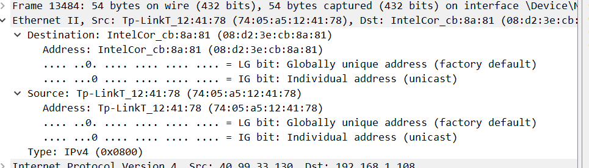

目的mac是08-d2-3e-cb-8a-81

源mac是74-05-a5-12-41-78

类型是ipv4

字节长度：432bits

你会发现 Wireshark 展现给我们的帧中没有校验字段，请了解一下原因。

因为抓包抓的是已经完成校验后果的包了，大概wireshark省略了

（2）

1.然后 ping qige.io （或者本子网外的主机都可以），同时用 Wireshark 抓这些包（可 icmp 过滤），记录一下发出帧的目的 MAC 地址以及返回帧的源 MAC 地址是多少？这个 MAC 地址是谁的？

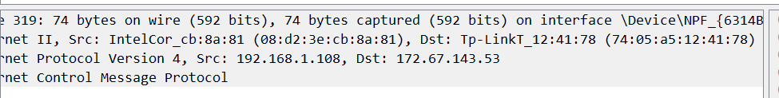

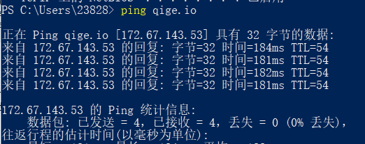

mac地址是网关的，因为帧都是发给下一个路由器的。

2.再次 ping www.cqjtu.edu.cn （或者本子网外的主机都可以），同时用 Wireshark 抓这些包（可 icmp 过滤），记录一下发出帧的目的 MAC 地址以及返回帧的源 MAC 地址又是多少？这个 MAC 地址又是谁的？

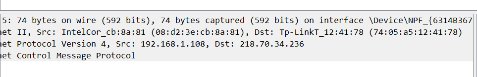

源：08-d2-3e-cb-8a-81是自家电脑的

目的：74-05-a5-12-41-78是网关的

1.访问本子网的计算机时，目的 MAC 就是该主机的

因为在本子网中时，没有与外界进行交互，所以没有经过网关，并且mac地址是作用域局域网的。

2.访问非本子网的计算机时，目的 MAC 是网关的

因为在非本子网时，与外界发生交互，由于网关使外界的出口，所以目的mac就一直是网关的。

（3）

1.再次使用 arp -d * 命令清空 arp 缓存

2.然后 ping qige.io （或者本子网外的主机都可以），同时用 Wireshark 抓这些包（可 arp 过滤）。查看这次 ARP 请求的是什么，注意观察该请求是谁在回应。
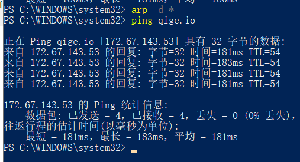

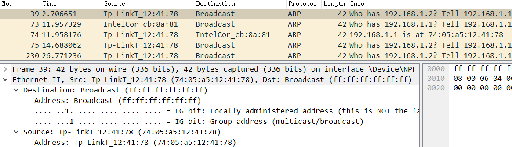

1.ARP 请求都是使用广播方式发送的

2.如果访问的是本子网的 IP，那么 ARP 解析将直接得到该 IP 对应的 MAC；如果访问的非本子网的 IP， 那么 ARP 解析将得到网关的 MAC。
请问为什么？

访问非子网IP时是通过路由器访问的，路由器再把arp请求发出去，目标IP收到请求后，再通过路由器端口IP返回回去，那么ARP解析将会得到网关的物理地
# 实验二网络层
（1）熟悉 IP 包结构

使用 Wireshark 任意进行抓包（可用 ip 过滤），熟悉 IP 包的结构，如：版本、头部长度、总长度、TTL、协议类型等字段。

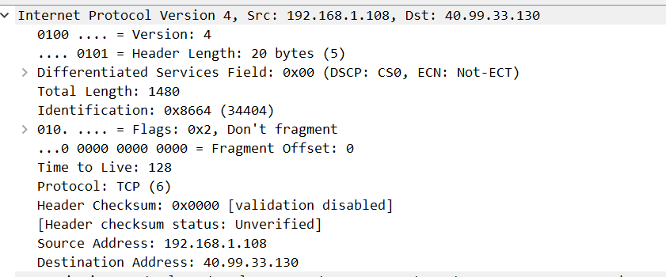

版本：ipv4 头部长度：20 总长度：1480  TTL：128  协议类型：tcp

为提高效率，我们应该让 IP 的头部尽可能的精简。但在如此珍贵的 IP 头部你会发现既有头部长度字段，也有总长度字段。请问为什么？

为了描述这个ip何时是数据，何时是报头，ip头部会给出头部字段长度和总字段长度，让计算机可以自行计算出从哪开始时数据。

（2）IP 包的分段与重组

根据规定，一个 IP 包最大可以有 64K 字节。但由于 Ethernet 帧的限制，当 IP 包的数据超过 1500 字节时就会被发送方的数据链路层分段，然后在接收方的网络层重组。

缺省的，ping 命令只会向对方发送 32 个字节的数据。我们可以使用 ping 202.202.240.16 -l 2000 命令指定要发送的数据长度。此时使用 Wireshark 抓包（用 ip.addr == 202.202.240.16 进行过滤），了解 IP 包如何进行分段，如：分段标志、偏移量以及每个包的大小等

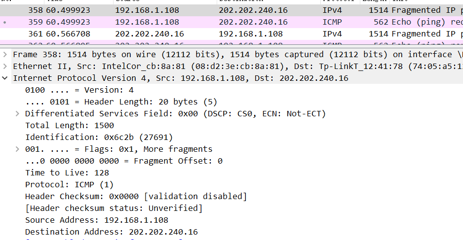

分段与重组是一个耗费资源的操作，特别是当分段由传送路径上的节点即路由器来完成的时候，所以 IPv6 已经不允许分段了。那么 IPv6 中，如果路由器遇到了一个大数据包该怎么办？

因为ipv6只允许源节点对包分段，而不再允许中间结点对包进行分段了，如果大于1500会丢弃让源节点重新发送

（3）考察 TTL 事件

在 IP 包头中有一个 TTL 字段用来限定该包可以在 Internet上传输多少跳（hops），一般该值设置为 64、128等。

在验证性实验部分我们使用了 tracert 命令进行路由追踪。其原理是主动设置 IP 包的 TTL 值，从 1 开始逐渐增加，直至到达最终目的主机。
请使用 tracert www.baidu.com 命令进行追踪，此时使用 Wireshark 抓包（用 icmp 过滤），分析每个发送包的 TTL 是如何进行改变的，从而理解路由追踪原理。

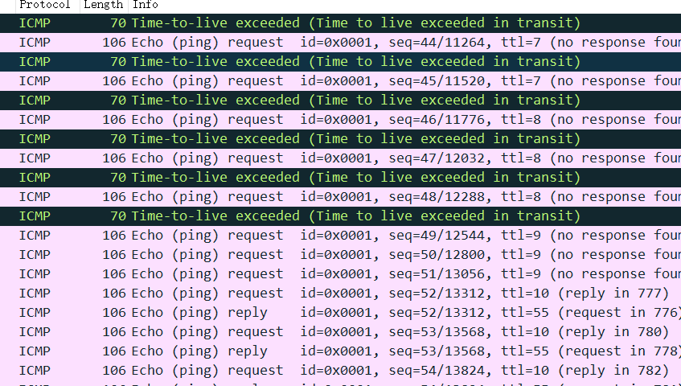

：IP 包的 TTL 值从 1 开始逐渐增加，直至到达最终目的主机，可以看见中间经过了10个路由器节点，当成功到达主机后主机会响应表示达到该主机

# 实验三：传输层
（1） 熟悉 TCP 和 UDP 段结构

1.用 Wireshark 任意抓包（可用 tcp 过滤），熟悉 TCP 段的结构，如：源端口、目的端口、序列号、确认号、各种标志位等字段。

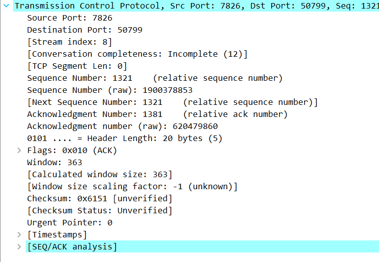

源端口7826 目的端口50799 序列号1321 确认号：1381  flags是标志位

2.用 Wireshark 任意抓包（可用 udp 过滤），熟悉 UDP 段的结构，如：源端口、目的端口、长度等。

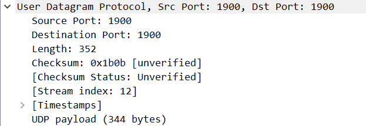

源端口号：1900 目的端口号1900 长度352

由上大家可以看到 UDP 的头部比 TCP 简单得多，但两者都有源和目的端口号。请问源和目的端口号用来干什么？

2在子网络中ip地址有时往往一些特别的原因是一样的，导致无法确认到底该将信息发给谁，这是因为不同的端口号就可以区分出来将信息发送给谁了。

（2）分析 TCP 建立和释放连接

1.打开浏览器访问 qige.io 网站，用 Wireshark 抓包（可用 tcp 过滤后再使用加上 Follow TCP Stream），不要立即停止 Wireshark 捕获，待页面显示完毕后再多等一段时间使得能够捕获释放连接的包。

2.请在你捕获的包中找到三次握手建立连接的包，并说明为何它们是用于建立连接的，有什么特征。

3.请在你捕获的包中找到四次挥手释放连接的包，并说明为何它们是用于释放连接的，有什么特征。

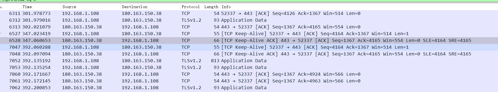

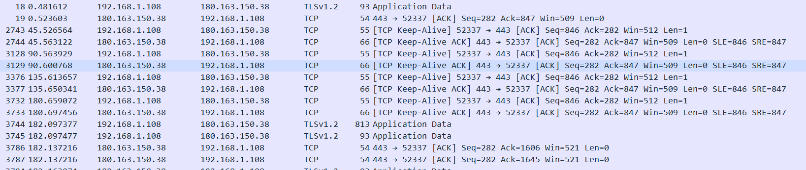

三次握手的标志位： 客户端发送数据， 序列号seq：标记数据段的顺序。

客户点请求建立连接，确认号ack：期待收到对方下一个报文段的第一个数据字节的序号。 服务端同意建立请求，回复确认。

确认ACK：占1位，仅当ACK=1时，确认号字段才有效。ACK=0时，确认号无效。 连接建立完成。 同步SYN：连接建立时用于同步序号。

终止FIN：用来释放一个连接。FIN=1表示：此报文段的发送方的数据已经发送完毕，并要求释放运输连接

第一次握手：syn=1,ack=0

第二次握手：syn=1,ack=1

第三次握手：syn=0,ack=1

请在你捕获的包中找到四次挥手释放连接的包，并说明为何它们是用于释放连接的，有什么特征。

同理，四次挥手释放包的查找也可以用标志位进行查询，如下： FIN=1，其序列号为seq=u；

TCP规定，FIN报文段即使不携带数据，也要消耗一个序号。

服务器收到连接释放报文，发出确认报文，ACK=1，ack=u+1，并且带上自己的序列号seq=v，此时，服务端就进入了CLOSE-WAIT（关闭等待）状态。
客户端收到服务器的确认请求后，此时，客户端就进入FIN-WAIT-2（终止等待2）状态，等待服务器发送连接释放报文（在这之前还需要接受服务器发送的最后的数据）。

服务器发送完数据后，再次向客户端发送连接释放的确认。FIN=1，ack=u+1，服务器就进入了LAST-ACK（最后确认）状态，等待客户端的确认。

客户端收到服务器的连接释放报文后，必须发出确认，ACK=1。 服务器只要收到了客户端发出的确认，释放连接。

建立状态：FIN=1,

seq=u 服务器确认：ACK=1，seq=u，ack=u+1

服务器询问释放连接：FIN=1, ACK=1，seq=w，ack=u+1

用户端回复：ACK=1，seq=u+1，ack=w+1

去掉 Follow TCP Stream，即不跟踪一个 TCP 流，你可能会看到访问 qige.io 时我们建立的连接有多个。请思考为什么会有多个连接？作用是什么？

访问qige.io的时候，不止一个端口与qige.io建立连接，而是许多端口同时与它建立连接

作用：可以同时进行加载数据，提高运行速度

我们上面提到了释放连接需要四次挥手，有时你可能会抓到只有三次挥手。原因是什么？
第二次和第三次可以合并
# 实验四：应用层
（1） 了解 DNS 解析

1.先使用 ipconfig /flushdns 命令清除缓存，再使用 nslookup qige.io 命令进行解析，同时用 Wireshark 任意抓包（可用 dns 过滤）。

2.你应该可以看到当前计算机使用 UDP，向默认的 DNS 服务器的 53 号端口发出了查询请求，而 DNS 服务器的 53 号端口返回了结果。

3.可了解一下 DNS 查询和应答的相关字段的含义

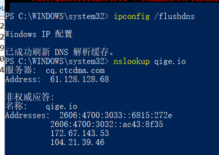

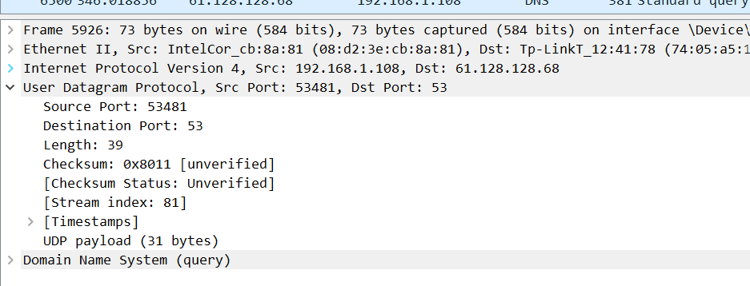

1.QR：查询/应答标志。0表示这是一个查询报文，1表示这是一个应答报文

2.opcode，定义查询和应答的类型。0表示标准查询，1表示反向查询（由IP地址获得主机域名），2表示请求服务器状态

3.AA，授权应答标志，仅由应答报文使用。1表示域名服务器是授权服务器

4.TC，截断标志，仅当DNS报文使用UDP服务时使用。因为UDP数据报有长度限制，所以过长的DNS报文将被截断。1表示DNS报文超过512字节，并被截断

5.RD，递归查询标志。1表示执行递归查询，即如果目标DNS服务器无法解析某个主机名，则它将向其他DNS服务器继续查询，如此递归，直到获得结果并把该结果返回给客户端。0表示执行迭代查询，即如果目标DNS服务器无法解析某个主机名，则它将自己知道的其他DNS服务器的IP地址返回给客户端，以供客户端参考

6.RA，允许递归标志。仅由应答报文使用，1表示DNS服务器支持递归查询

7.zero，这3位未用，必须设置为0

8.rcode，4位返回码，表示应答的状态。常用值有0（无错误）和3（域名不存在）

你可能会发现对同一个站点，我们发出的 DNS 解析请求不止一个，思考一下是什么原因？

因为dns服务器并不只有一台，有可能单独的一台没有我们所需要的信息，所以我们会向各个dns服务器发送消息来获取数据

（2） 了解 HTTP 的请求和应答

1.打开浏览器访问 qige.io 网站，用 Wireshark 抓包（可用http 过滤再加上 Follow TCP Stream），不要立即停止 Wireshark 捕获，待页面显示完毕后再多等一段时间以将释放连接的包捕获。

2.请在你捕获的包中找到 HTTP 请求包，查看请求使用的什么命令，如：GET, POST。并仔细了解请求的头部有哪些字段及其意义。

3.请在你捕获的包中找到 HTTP 应答包，查看应答的代码是什么，如：200, 304, 404 等。并仔细了解应答的头部有哪些字段及其意义。

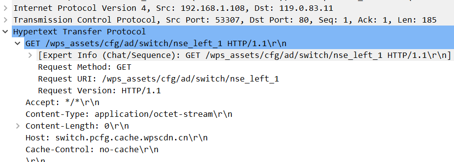

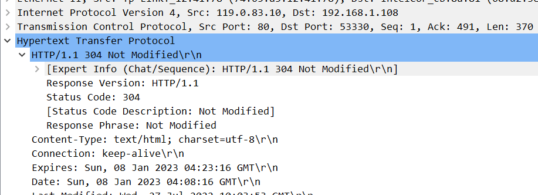

刷新一次 qige.io 网站的页面同时进行抓包，你会发现不少的 304 代码的应答，这是所请求的对象没有更改的意思，让浏览器使用本地缓存的内容即可。那么服务器为什么会回答 304 应答而不是常见的 200 应答？

服务器对于浏览器的第一次应答对于浏览器来说已经有了缓存，因此浏览器第二次发送请求的时候，服务器会回复浏览器上次请求的资源现在在缓存里，服务器根据浏览器传来的时间发现和当前请求资源的修改时间一致，应答304，表示不再重新传送。

