# 实验1： ipconfig
自己：
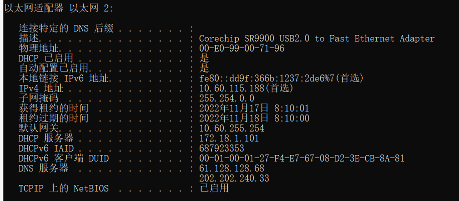
室友：
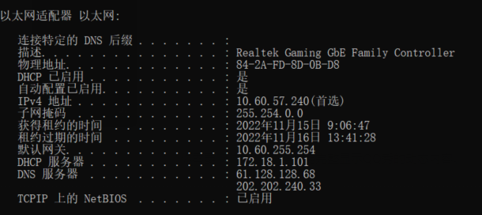

（1）

物理地址：物理地址是一种标识符，用来标记网络中的每个设备。由于网络设备对物理地址的处理能力有限，物理地址只在当前局域网内有效
DHCP已启用：DHCP是动态分配ip的协议，ip自动获取时会启用。
IPv4 地址：本地在局域网内的ip地址

子网掩码：化成二进制，全面是1的表示为网络号，后面为0的表示为主机号
默认网关：默认网关ip地址，意思是一台主机如果找不到可用的网管，就把数据包发给默认指定的网关，由这个网关来处理数据包。也就是你路由器的地址。

DNS 服务器：域名解析服务器的地址，将网址翻译成IP地址。

（2）

通过比较发现自身ip与室友ip不相同，但子网掩码都是相同的，默认网关也是相同的。

判断2台电脑是否处于同一子网 通过ip地址与子网掩码的与运算 即可得到

我ip：10.60.115.188

室友：10.60.57.240

子网掩码：255.254.0.0

由此可知的出的网络号均为10.60.0.0所以2人ip属于同一子网中。

# 实验2：ping
(1)

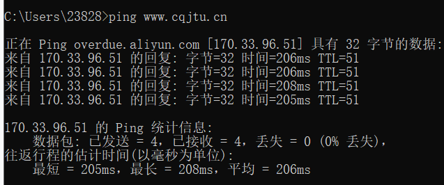
时间表示：此电脑到重庆交通大学的时间大概需要205ms~208ms

TTL表示：代表者一个计时功能当，每经过一个路由器就减一，当减至0是就将此包丢弃。

(2)

ping -i 50 修改默认的生存时间。
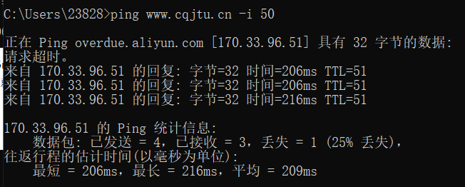
使用ping -n对发送 count 指定的 ECHO 数据包数
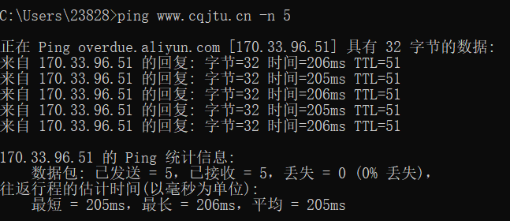
假设你不能 ping 通某计算机或 IP，但你确定该计算机和你之间的网络是连通的，那么可能的原因是什么？该如何处理能保证 ping 通？

由近到远的进行ping，

首先可以先测试自己电脑ping 127.0.0.1如果失败说明本机网卡出现了问题，
在测试与自己电脑在同一子网的电脑，如果失败说明本机到交换机出现错误
在对ping子网出网口，如果失败则说明网关出现问题你无能为力。
最后ping目标地址，失败也表示此问题你无能为力。

假设在秘籍中进行的网络排查中，ping 百度的 IP 即 ping 14.215.177.39 没问题，但 ping 百度的域名即 ping www.baidu.com 不行，那么可能的原因是什么？如何进行验证和解决？
另外，经常有同学问到的："能上 QQ，但不能上网" 跟这个问题的原因是相似的。

我认为既然能ping通ip地址说明此ip是存在的。而无法ping通域名则说明是域名转换为ip地址失败应该是DNS出现了问题。
解决方法

咨询当地部门，是否当地dns服务器故障
# 实验三tracert
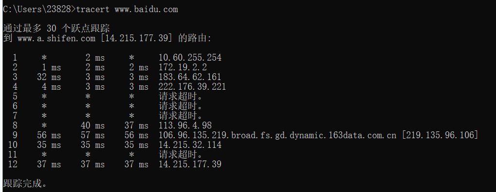
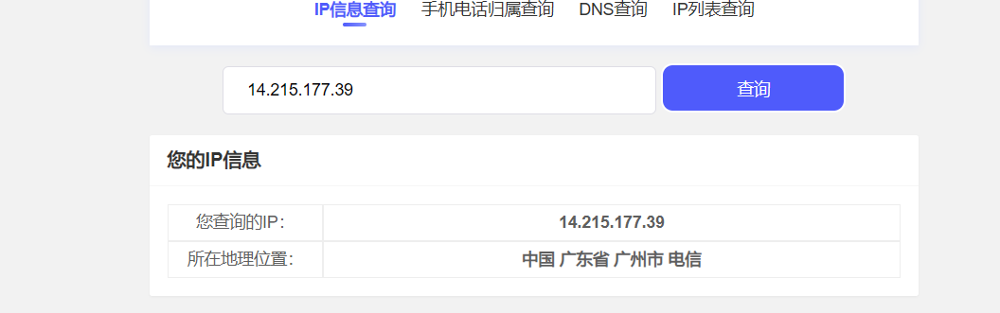

tracert 能告诉我们路径上的节点以及大致的延迟等信息，那么它背后的原理是什么？

tracert回答出一个TTL值为1的cimp数据包，当到达第一个路由器时，路由器会将报的TTL-1变为0丢弃掉，并返回一个超市通知，里面包含里路游戏的ip地址，之后在发出一个TTL+1的包，重复上述过程，通过这样的手段tracert就可以获得本电脑到目标电脑所有路由器的ip。而延迟而是来回一趟所花费的时间。

在以上两个实作中，如果你留意路径中的节点，你会发现无论是访问百度还是棋歌教学网，路径中的第一跳都是相同的，甚至你应该发现似乎前几个节点都是相同的，你的解释是什么？

我认为是显出子网，再出网关，最后出重庆交通大学只有一个与外界交互的交换机，所以前几个才会是一样的，当网络离开重庆交通大学时，就开始收到其他因素的影响，向着不同的路由器节点去了。

在追踪过程中，你可能会看到路径中某些节点显示为 * 号，这是发生了什么？
某些路由器不会为其 TTL 值已过期的数据包返回“已超时”消息，而且这些路由器对于 tracert 命令不可见。在这种情况下，将为该跃点显示一行星号 (*)。 tracert的时候出现*号的行列说明有路由器（也许是出于安全考虑，也许是网络问题）没有回应。所以出现*号
# 实验四 ARP
(1)
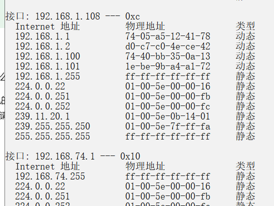
缓存了ip地址与mac地址的对应表。

你可能会在实作三的操作中得到 "ARP 项添加失败: 请求的操作需要提升" 这样的信息，表示命令没能执行成功，你该如何解决？

。由于arp的部分操作是适用于win7的当电脑时win10时就无法使用此命令了，于是就用netsh来代替，并且还要以管理员的身份进行运行。
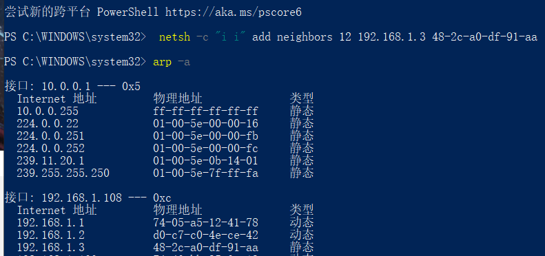
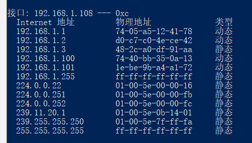
（2）
请使用 arp /? 命令了解该命令的各种选项。
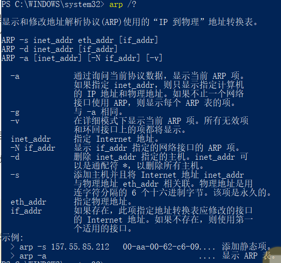
一般而言，arp 缓存里常常会有网关的缓存，并且是动态类型的。

假设当前网关的 IP 地址是 192.168.0.1，MAC 地址是 5c-d9-98-f1-89-64，请使用 arp -s 192.168.0.1 5c-d9-98-f1-89-64 命令设置其为静态类型的。
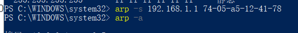
运行成功

在实作三中，为何缓存中常常有网关的信息？

缓存中是计算机曾经访问过的记录，访问其他地址需要网关信息，因此缓存中会存在网关的信息

我们将网关或其它计算机的 arp 信息设置为静态有什么优缺点？

优点是：可以为每台计算机都分配一个固定的ip地址，便于管理，可以更具固定的ip地址产生的流量为依据管理，可以免除对于电脑用户繁杂的身份验证方式。

缺点是：如果被他人恶意盗用，将会对正常的网络产生影响，并且极大可能为用户造成财产损失
# 实验五DHCP
（1）
一般地，我们自动获取的网络配置信息包括：IP 地址、子网掩码、网关 IP 以及 DNS 服务器 IP 等。使用 ipconfig/release 命令释放自动获取的网络配置，并用 ipconfig/renew 命令重新获取，了解 DHCP 工作过程和原理

客户机通过将搜索消息广播到本地子网上的有限广播地址 (255.255.255.255) 来搜索 DHCP 服务器。如果存在路由器并已将其配置为充当 BOOTP 中继代理的角色，请求便会传送到不同子网上的其他 DHCP 服务器。客户机的广播包括其唯一的 ID，在 Oracle Solaris 中的 DHCP 实现中，此 ID 由客户机的介质访问控制 (Media Access Control, MAC) 地址派生而来。在以太网上，MAC 地址与以太网地址相同

在Windows系统下，如果由于某种原因计算机不能获取 DHCP 服务器的配置数据，那么Windows将会根据某种算法自动配置为 169.254.x.x 这样的 IP 地址。显然，这样的 IP 以及相关的配置信息是不能让我们真正接入 Internet 的，为什么？既然不能接入 Internet，那么Winodws系统采用这样的方案有什么意义？

ip变成169.254.x.x是pc的网卡启动时，检测到环境中存在ip冲突，操作系统为保护起见分配的保留ip地址.并要求网关mac，网关不响应，此时，系统托盘的网卡标志位受限
# 实验六netstat
（1）
Windows 系统将一些常用的端口与服务记录在 C:\WINDOWS\system32\drivers\etc\services 文件中，请查看该文件了解常用的端口号分配。
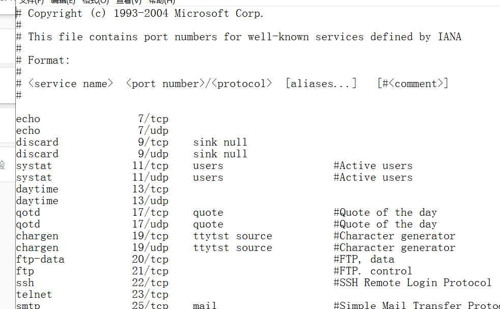
（2）
使用 netstat -an 命令，查看计算机当前的网络连接状况
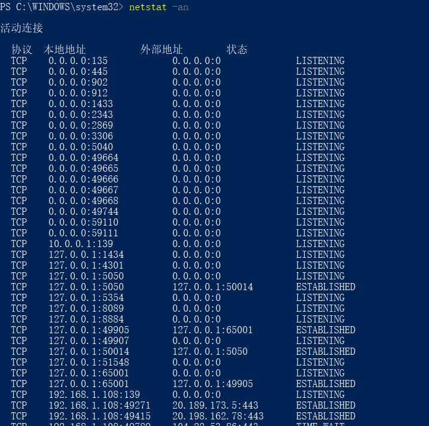

# 实验七DNS
（1）
Windows 系统将一些固定的/静态的 DNS 信息记录在 C:\WINDOWS\system32\drivers\etc\hosts 文件中，如我们常用的 localhost 就对应 127.0.0.1 。请查看该文件看看有什么记录在该文件中。
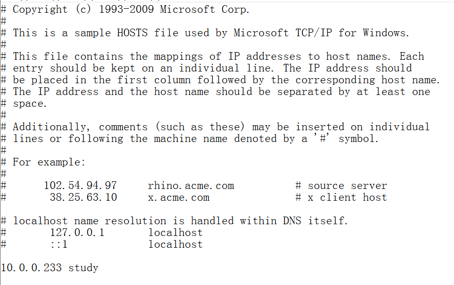
（2）
解析过的 DNS 记录将会被缓存，以利于加快解析速度。请使用 ipconfig /displaydns 命令查看。我们也可以使用 ipconfig /flushdns 命令来清除所有的 DNS 缓存。
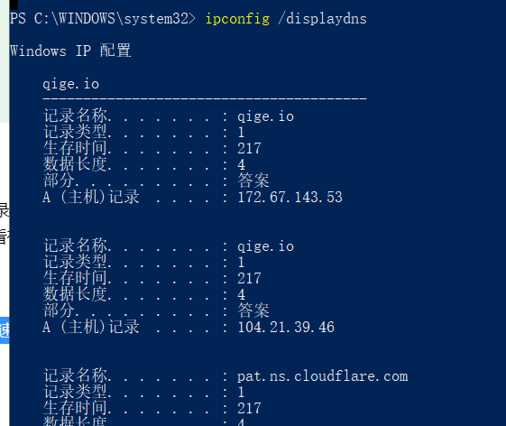
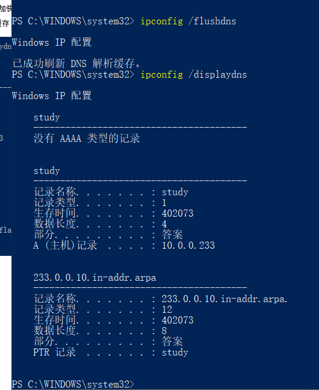
（3）
使用 nslookup qige.io 命令，将使用默认的 DNS 服务器查询该域名。当然你也可以指定使用 CloudFlare（1.1.1.1）或 Google（8.8.8.8） 的全球 DNS 服务器来解析，如：nslookup qige.io 8.8.8.8，当然，由于你懂的原因，这不一定会得到正确的答案。
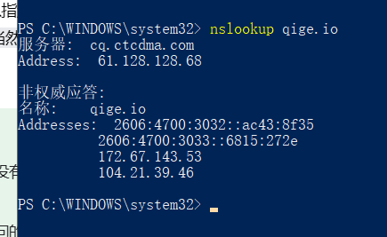

# 实验八cache
（1）
打开 Chrome 或 Firefox 浏览器，访问 https://qige.io ，接下来敲 F12 键 或 Ctrl + Shift + I 组合键打开开发者工具，选择 Network 面板后刷新页面，你会在开发者工具底部看到加载该页面花费的时间。请进一步查看哪些文件被 cache了，哪些没有。
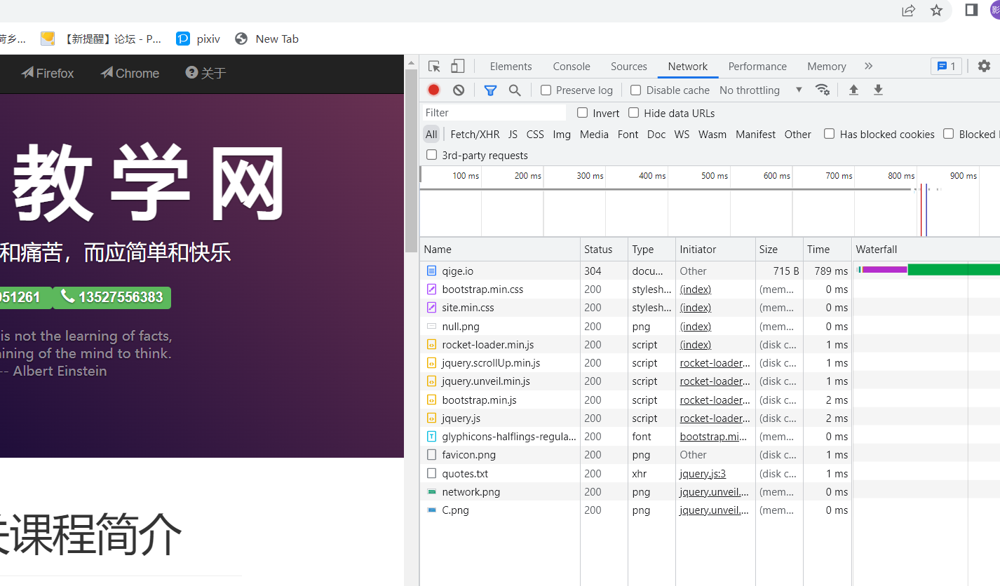
（2）
接下来仍在 Network 面板，选择 Disable cache 选项框，表明当前不使用 cache，页面数据全部来自于 Internet，刷新页面，再次在开发者工具底部查看加载该页面花费的时间。你可比对与有 cache 时的加载速度差异。
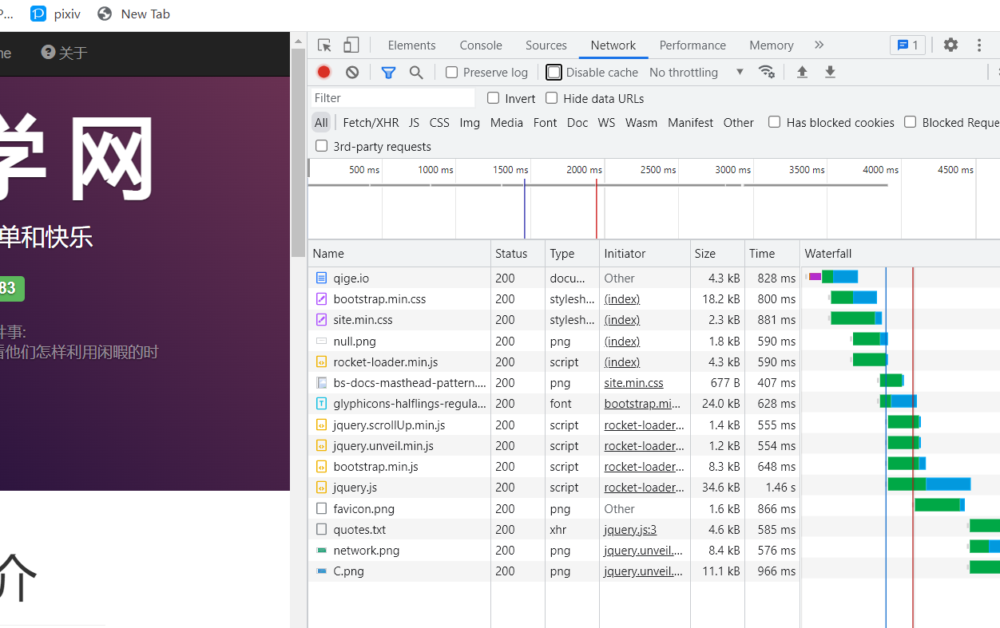
